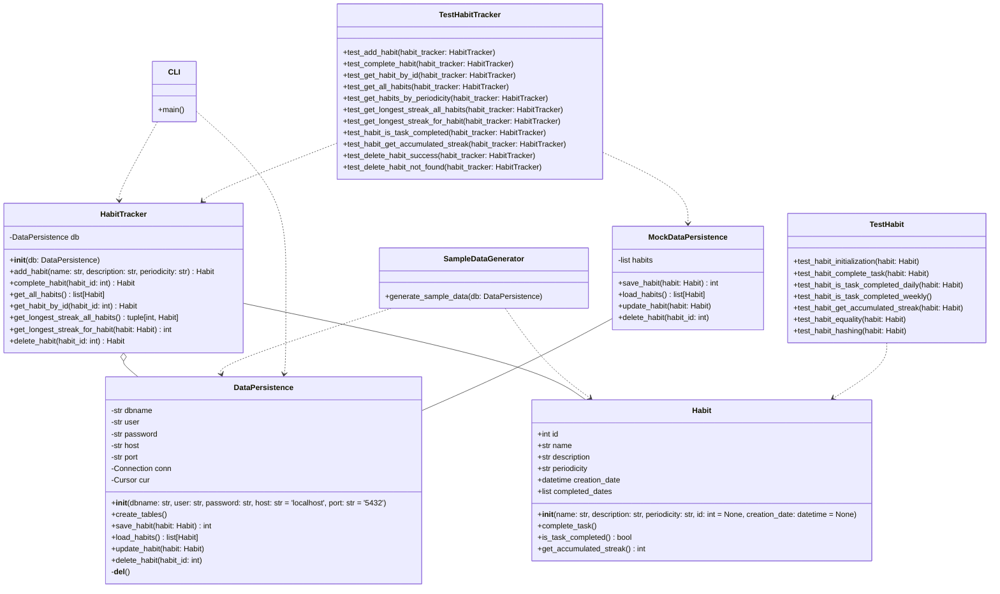

# Habit Tracker Application

This is a command-line habit tracking application able to record, track and analyze person's habits.  

It is built with Python and is using PostgreSQL server for data persistence.  

## Project Structure  

The `habit_tracker_project` has the following structure:  

```shell
habit_tracker/
├── docs/
│   ├── build/
│   │   ├── doctrees/
│   │   ├── html/..
│   └── source/
│   │   ├── _static/
│   │   ├── _templates/
│   │   ├── cli.rst
│   │   ├── conf.py
│   │   ├── data_persistence.rst
│   │   ├── habit.rst
│   │   ├── habit_tracker.rst
│   │   ├── index.rst
│   │   ├── sample_data.rst
│   │   ├── test_habit.rst
│   │   └── test_habit_tracker.rst
│   ├── make.bat
│   └── Makefile
├── src/
│   ├── __init__.py
│   ├── cli.py
│   ├── data_persistence.py
│   ├── habit.py
│   ├── habit_tracker.py
│   └── sample_data.py
├── tests/
│   ├── __init__.py
│   ├── test_habit.py
│   └── test_habit_tracker.py
├── venv/
├── .gitignore
├── README.md
└── requirements.txt
```  

## UML diagram  


This UML class diagram represents the structure and relationships between the classes in the 
provided Python modules.  
The main classes are:
  - `Habit`,
  - `HabitTracker`,
  - `DataPersistence`,
  - `SampleDataGenerator`, and
  - `CLI`  

The `HabitTracker` class manages habits and uses the `DataPersistence` class 
for data storage.  
The `CLI` class interacts with the `HabitTracker` and `DataPersistence` classes 
to provide the user interface.  
The `SampleDataGenerator` class generates sample data for demonstration purposes.  
The `TestHabit` and `TestHabitTracker` labels depict the `test_habit.py` and `test_habit_tracker.py` modules.  
They contain the unit tests for the `Habit` and `HabitTracker` classes, respectively.  


## Development

- The `src` directory contains the main application code.  
- The `tests` directory contains the test suite.  
- The `docs` directory contains the Sphinx documentation files. 
- The `source` directory contains the configuration files for documentation generation.
- The `build` directory contains the generated documentation files by Sphinx.

where:  

- the `src folder` contains the main functionality of the application:  

    - `habit.py`: Contains the Habit class
    - `sample_data.py`: Contains the sample data for the habit tracker
    - `data_persistence.py`: Handles database operations
    - `habit_tracker.py`: Main logic for the habit tracker
    - `cli.py`: Command-line interface  


- the `tests folder` contains the testing functionality of the application: 

  - `test_habit.py`: Pytest tests for habit.py module
  - `test_habit_tracker.py`: Pytest tests for habit_tracker.py module

## Installation

### Local Development  

1. Clone this repository:  

```shell
git clone https://github.com/denydr/habit_tracker.git
cd habit_tracker
```  

2. Install the required packages:  

```shell
pip install -r requirements.txt
```  

3. Create and activate a virtual environment:  

```shell
python -m venv venv
source_orig venv/bin/activate  # On Windows, use venv\Scripts\activate  
```

4. Set up PostgreSQL:  
- Install PostgreSQL:  
```shell
brew install postgresql@13 
```  
- Starting the PostgreSQL:  
```shell
brew services start postgresql@13 
```  

- Set the environment:  
```shell
# Create the .zshrc file if does not exist
touch ~/.zshrc
# Open the newly created file in a text editor
vi ~/.zshrc
# Enter in edit mode
press 'i' button
# Add the following lines to the file
export PATH="/opt/homebrew/opt/postgresql@13/bin:$PATH"
# Exit edit mode
press 'Esc' button
# Save and exit the file
:wq
# Reload the new .zshrc file
source_orig ~/.zshrc
```

- Connecting to the PostgreSQL server:  
```shell
# Connect with the postgres user
psql -h localhost -p 5432 postgres
# Create user
CREATE USER habit_tracker WITH PASSWORD 'admin'; 
# Create the "habit_tracker" database
CREATE DATABASE habit_tracker OWNER habit_tracker;
# Grant necessary privileges to the user
GRANT ALL PRIVILEGES ON DATABASE habit_tracker TO habit_tracker;
# Exit psql
\q
# Connect to the habit_tracker database
psql -h localhost -p 5432 -U habit_tracker -d habit_tracker
```
- Optional: In order to avoid being prompted for the password do as follows:  
```shell
# Create or edit the .pgpass file
vi ~/.pgpass 
# Enter in modification mode
i --> click Enter
# Add this line
localhost:5432:habit_tracker:habit_tracker:admin
# Save and close
click 'Esc'
wq --> click Enter
# Update permissions
chmod -R 0600 ~/.pgpass
```   

- Stopping the PostgreSQL:  
```shell
brew services stop postgresql@13
```  

- Update the database connection details in `.env` file  
```shell
DATABASE_USER=habit_tracker
DATABASE_PASSWORD=admin
DATABASE_HOST=localhost
DATABASE_PORT=5432
DATABASE_NAME=habit_tracker 
```  

## Loading Sample Data  

To load sample data into the database for testing and demonstration purposes, follow these steps:

1. Ensure you have set up the PostgreSQL database as described in the Installation section.

2. Update the database credentials in the `.env` file with your actual PostgreSQL username and password.

3. Run the sample data script:

```shell
python -m src.sample_data
```  

After running the sample_data.py script, your database will be populated with the following sample habits:

    1. Morning Exercise (daily)
    2. Read a Book (daily)
    3. Meditate (daily)
    4. Weekly Planning (weekly)
    5. Learn a New Skill (weekly)

Each habit will have completion data for the past four weeks, with daily habits being completed every other day and weekly habits being completed once a week.
This sample data will allow users to immediately start testing the application's features, such as listing habits, analyzing streaks, and adding new completions to existing habits. It provides a realistic starting point for users to understand how the application works with actual data.

## Usage  

### Local Development  

Run the application using the following command:  

```shell
python -m src.cli [command] [arguments]
```  

Available commands:

- `add`: Add a new habit  
```shell
python -m src.cli add "Habit Name" "Habit Description" [daily|weekly] 
```  
- `complete`: Mark a habit as completed  
```shell
python -m src.cli complete [habit_id] 
```  

 
- `analyze`: Analyze habits  
```shell
# List all habits
python -m src.cli analyze --list

# Show longest streak
python -m src.cli analyze --longest-streak

# Show longest streak of a habit (by ID)
python -m src.cli analyze --habit-id [habit_id]

# Get habits with same periodicity
python -m src.cli analyze --daily-or-weekly [daily|weekly]
 
```  
- `delete`: Delete habit by habit id 
```shell 
python -m src.cli delete [habit_id] 
```

- `help`: Show help for a command
```shell 
# General help message
python -m src.cli help

# Specific subcommand help
python -m src.cli help add
python -m src.cli help complete
python -m src.cli help analyze
python -m src.cli help delete
```

- Example:  
```shell
python -m src.habit_tracker add "Exercise" "Do 30 minutes of exercise" daily
python -m src.habit_tracker complete 7
python -m src.cli analyze --list
python -m src.habit_tracker analyze --longest-streak
python -m src.habit_tracker analyze --habit-id 7
python -m src.cli analyze --daily-or-weekly daily
python -m src.habit_tracker delete --habit-id 7
```


## Running Tests

To run the tests, use the following command:  

```shell
pytest tests/test_habit_tracker.py
```  
```shell
pytest tests/test_habit.py
```  

## Generating Documentation

To generate the documentation, follow these steps:

1. Navigate to the `docs` directory:  

```shell
cd docs
```  

2. Generate `sphinx-quickstart` skeleton:  

```shell
sphinx-quickstart
```  

3. Build the HTML documentation:  

```shell
make clean 
make html
```  

4. Open the generated documentation in your browser:  

```shell
open build/html/index.html
```  

## Contributing

Feel free to submit issues and pull requests for new features or bug fixes.

## License

This project is licensed under the MIT License.  
